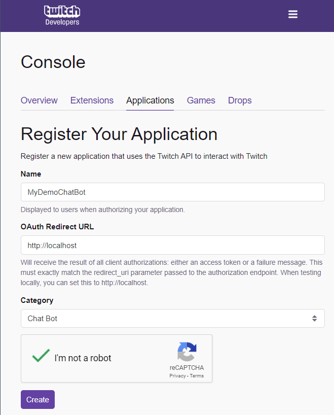
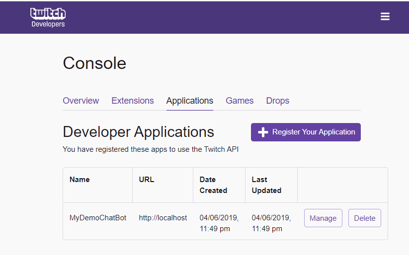

Twitch.MediatR
==============


[](https://github.com/BenjaminAbt/Twitch.MediatR) 
[](https://www.nuget.org/packages/Twitch.MediatR)  
[](https://www.nuget.org/packages/Twitch.MediatR.AspNetCore)  

This repository shows how to react to Twitch events with the help of [MediatR](https://github.com/jbogard/MediatR) (CQRS).
The events correspond to the library [TwitchLib](https://github.com/TwitchLib/TwitchLib). You can work with the same events as before, if you used the TwitchLib library.

## How it works

`Twitch.MediatR` listens to `TwitchLib` events, catches the event arguments and publishes these arguments via MediatR as notification.

```cs
    private async void Client_OnMessageReceived(object sender, OnMessageReceivedArgs e)
    {
        await _eventProxy.PublishAsync(new TwitchChannelMessageNotification(this, e.ChatMessage)).ConfigureAwait(false);
    }
```

You can subscribe to these notification with the help of a MediatR notification handler
```cs
    public class TwitchChannelMessageNotificationHandler : INotificationHandler<TwitchChannelMessageNotification>
    {
        public async Task Handle(TwitchChannelMessageNotification request, CancellationToken cancellationToken = default)
        {
            string channel = request.ChatMessage.Channel;
            string response = $"Echo: {request.ChatMessage.Message}";

            await request.ChannelLink.SendMessageAsync(channel, response).ConfigureAwait(false);
        }
    }
```

MediatR finds all registered handlers by passing the assembly in which the handlers are located.
It is possible to pass multiple assemblies.

```cs
    services.AddTwitch(options => Configuration.Bind("Twitch", options),
        Assembly.GetAssembly(typeof(Startup)) // use current assembly, here are our handlers
        );
```

## Samples 

This repository also provides to samples
- [ASP.NET Core Web Application](samples/TwitchChatBot.WebApp): echo to all messages in the twitch channel.
- [.NET Core Console Application](samples/TwitchChatBot.ConsoleApp): mirrors all messages to your console.

The ASP.NET Core appliation uses the `Twitch.AspNetCore` middleware to attach to the application'S lifetime and connects/disconnects automatically to the configured channels in `appsettings.json`.
In a real world app this stuff is stored inside your database.

The ASP.NET Core sample is based on version 2.1, but you can migrate to 3.0 with following changes:
- [Change IApplicationLifetime](https://github.com/aspnet/Announcements/issues/344)

Hint: right now there is no .NET SDK 3.0 available on the Hosted Build Agents on Azure DevOps.

The .NET Console uses `IHostService` to provide built-in dependendcy injection. 

## Configuration:

In the configuration file `appsettings.json` the Twitch credentials, the bot name and the channels to be join are stored.
In your real-world application, such information will come from the database or your environment variables (Azure WebApp Application Settings).

```json
{
  "Twitch": {
    "UserName": "SchwabenCode", // Your Bot's name here
    "AcessToken": "abcdefghijklmnopqrstuvwxyz", // Your access key here
    "Channels": ["BenAbt"] // Your channels here
  }
}
```

As soon as the bot starts, it will try to authenticate to Twitch.
If the authentication is successful, the bot will join the configured channels. If the authentication fails, a `TwitchIncorrectLoginNotification` can be handled.

The bot can then actively listen to all Twitch events e.g. messages.
A separate `TwitchChannelLink` is created for each configured channel. The `TwitchChannelLink` serves as a proxy so that an action can be reacted to in the events via the TwitchLink.

## Prerequisites - Twitch Credentials

* Create an account on https://twitch.com - This account will be used as identity for the Bot. Hint: You can enable in your settings to use a single e-mail address on Twitch for multiple accounts (see "Security and Privary" > "Enable additional account creation")
* Link your account to the Twitch developer portal https://dev.twitch.com
* Create an App in your Twitch Dev Console



The name here is not your bot's username, it is just the name for your application in your Twitch Developer Console application table.

* Generate an access token. The easiest way is to use https://twitchtokengenerator.com/
The webpage will ask you which kind of bot you want to register; just use "chat bot", link your account and the access token will work.
If you want to have special features like whisper messages, you have to activate the corresponding scopes.

* Copy the access token to your application settings or your environment configuration (e.g. Azure WebApp Application Settings). You will not see the access_token again!

Now the application is ready to authorize against Twitch and to listen to Twitch events.

## Dependencies and references

- [TwitchLib](https://github.com/TwitchLib/TwitchLib)
- [MediatR](https://github.com/jbogard/MediatR)
- [Azure DevOps Build Scripts](https://github.com/BenjaminAbt/AzureDevOps-YamlBuildSamples)
- [Twitch Logo](https://www.twitch.tv/p/brand/)

## License

[MIT License](LICENSE)
